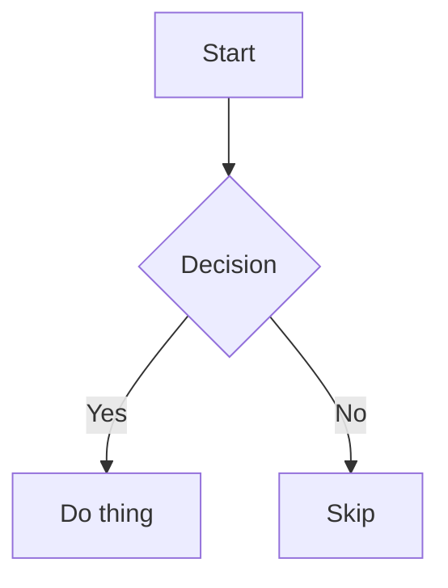

# Markdown — Complete Reference Guide

A comprehensive Markdown help file: core syntax, images, links, tables, advanced extensions, and further resources.

---

## Table of Contents

1. [Headings](#1-headings)
2. [Text Formatting](#2-text-formatting)
3. [Lists](#3-lists)
4. [Links](#4-links)
5. [Images](#5-images)
6. [Blockquotes](#6-blockquotes)
7. [Code](#7-code)
8. [Tables](#8-tables)
9. [Horizontal Rules & Line Breaks](#9-horizontal-rules--line-breaks)
10. [Footnotes](#10-footnotes)
11. [Definition Lists](#11-definition-lists)
12. [Task Lists](#12-task-lists)
13. [Collapsible Sections](#13-collapsible-sections)
14. [Escaping Characters](#14-escaping-characters)
15. [Raw HTML in Markdown](#15-raw-html-in-markdown)
16. [Emoji](#16-emoji)
17. [Math (LaTeX)](#17-math-latex)
18. [Diagrams (Mermaid)](#18-diagrams-mermaid)
19. [Hugo Front Matter](#19-hugo-front-matter)
20. [Further Resources](#20-further-resources)

---

## 1. Headings

```markdown
# H1
## H2
### H3
#### H4
##### H5
###### H6
```

# H1
## H2
### H3
#### H4
##### H5
###### H6

---

## 2. Text Formatting

| Syntax | Example | Result |
|---|---|---|
| `*italic*` / `_italic_` | `*text*` | *text* |
| `**bold**` | `**text**` | **text** |
| `***bold italic***` | `***text***` | ***text*** |
| `~~strikethrough~~` | `~~text~~` | ~~text~~ |
| `` `inline code` `` | `` `code` `` | `code` |
| `==highlight==` (some flavors) | `==text==` | ==text== |

---

## 3. Lists

**Unordered:**
```markdown
- Item one
- Item two
  - Nested item
    - Deeper nested
- Item three
```
- Item one
- Item two
  - Nested item
    - Deeper nested
- Item three

**Ordered:**
```markdown
1. First
2. Second
   1. Sub-step
3. Third
```
1. First
2. Second
   1. Sub-step
3. Third

---

## 4. Links

**Inline:**
```markdown
[Anthropic](https://www.anthropic.com)
[Link with title](https://www.anthropic.com "Anthropic homepage")
```
[Anthropic](https://www.anthropic.com)

**Reference-style** (useful for reusing the same link, or keeping paragraphs clean):
```markdown
Check out [Anthropic][anthropic-link] and their [docs][docs-link].

[anthropic-link]: https://www.anthropic.com
[docs-link]: https://docs.claude.com
```
Check out [Anthropic][anthropic-link] and their [docs][docs-link].

[anthropic-link]: https://www.anthropic.com
[docs-link]: https://docs.claude.com

**Automatic links:**
```markdown
<https://www.anthropic.com>
```
<https://www.anthropic.com>

**Internal anchor links** (jump to a heading in the same document):
```markdown
[Jump to Tables](#8-tables)
```

---

## 5. Images

**Basic syntax:**
```markdown

```


**Image with title (tooltip on hover):**
```markdown

```

**Image as a link** (wrap the image markdown in link markdown):
```markdown
[](https://www.anthropic.com)
```
[](https://www.anthropic.com)

**Sized/controlled images** — plain Markdown has no size syntax, so use raw HTML instead:
```markdown

```


**Reference-style images** (same benefit as reference-style links):
```markdown
![Alt text][photo-ref]

[photo-ref]: https://picsum.photos/400/200
```

---

## 6. Blockquotes

```markdown
> Single-line quote.

> Multi-line quote
> continues here.
>
> > Nested quote.
```

> Multi-line quote
> continues here.
>
> > Nested quote.

---

## 7. Code

Inline: `` `like this` ``

Fenced with syntax highlighting:

````markdown
```python
def hello():
    print("Hello, world!")
```
````

```python
def hello():
    print("Hello, world!")
```

```bash
hugo server -D
```

---

## 8. Tables

```markdown
| Left | Center | Right |
|:---|:---:|---:|
| a | b | c |
| 1 | 2 | 3 |
```

| Left | Center | Right |
|:---|:---:|---:|
| a | b | c |
| 1 | 2 | 3 |

Colons control alignment: `:---` left, `:---:` center, `---:` right.

---

## 9. Horizontal Rules & Line Breaks

```markdown
---
***
___
```
All three produce a horizontal rule.

**Line breaks:**
- Blank line → new paragraph.
- Two trailing spaces at end of line → soft break, same paragraph.
- `\` at end of line → forced break (most flavors).

---

## 10. Footnotes

```markdown
This needs a citation.[^1]

[^1]: Source or explanation goes here.
```
This needs a citation.[^1]

[^1]: Source or explanation goes here.

---

## 11. Definition Lists

(Supported in Hugo/GFM extensions, not core CommonMark)

```markdown
Term
: Definition of the term.

Markdown
: A lightweight markup language for formatting plain text.
```
Term
: Definition of the term.

---

## 12. Task Lists

```markdown
- [x] Draft essay
- [x] Cite sources
- [ ] Submit for review
```
- [x] Draft essay
- [x] Cite sources
- [ ] Submit for review

---

## 13. Collapsible Sections

Uses raw HTML `<details>`/`<summary>` — renders on GitHub, and in most Hugo themes:

```markdown
<details>
<summary>Click to expand</summary>

Hidden content goes here. Can include **markdown** too.

</details>
```

<details>
<summary>Click to expand</summary>

Hidden content goes here. Can include **markdown** too.

</details>

---

## 14. Escaping Characters

```markdown
\*not italic\*
\# not a heading
\[not a link\]
```
\*not italic\*

Escapable characters: `\` `` ` `` `*` `_` `{}` `[]` `()` `#` `+` `-` `.` `!`

---

## 15. Raw HTML in Markdown

Most Markdown processors (including Hugo's Goldmark) allow inline HTML:

```markdown
<div style="color: red;">This text is styled with raw HTML.</div>

<br>

<sub>subscript</sub> and <sup>superscript</sup>
```

<sub>subscript</sub> and <sup>superscript</sup>

---

## 16. Emoji

GitHub/many static site generators support shortcodes:

```markdown
:tada: :rocket: :white_check_mark:
```
🎉 🚀 ✅ (rendering depends on the platform's emoji support)

---

## 17. Math (LaTeX)

Supported if the renderer includes MathJax/KaTeX (Hugo needs this configured explicitly):

```markdown
Inline: $E = mc^2$

Block:
$$
\int_0^\infty e^{-x} dx = 1
$$
```

---

## 18. Diagrams (Mermaid)

Supported if the site/renderer includes Mermaid.js (common in docs themes):

````markdown

````

---

## 19. Hugo Front Matter

Metadata block Hugo reads before rendering content — not core Markdown, but essential for `.md` files in a Hugo site:

```yaml
---
title: "Post Title"
date: 2026-07-12T10:00:00+01:00
draft: false
tags: ["markdown", "hugo"]
categories: ["reference"]
description: "A short summary for SEO/previews."
featured_image: "/images/cover.jpg"
---
```

---

## 20. Further Resources

- [CommonMark Spec](https://commonmark.org/) — the core standard.
- [GitHub Flavored Markdown Spec](https://github.github.com/gfm/) — tables, task lists, strikethrough, autolinks.
- [Hugo's Content Management docs](https://gohugo.io/content-management/formats/) — how Hugo's Goldmark renderer extends Markdown.
- [Markdown Guide](https://www.markdownguide.org/) — general-purpose cheat sheets and tutorials.

---

*Tip: not every renderer supports every feature above (math, mermaid, and definition lists especially vary). Test in your actual Hugo build before relying on the fancier extensions.*